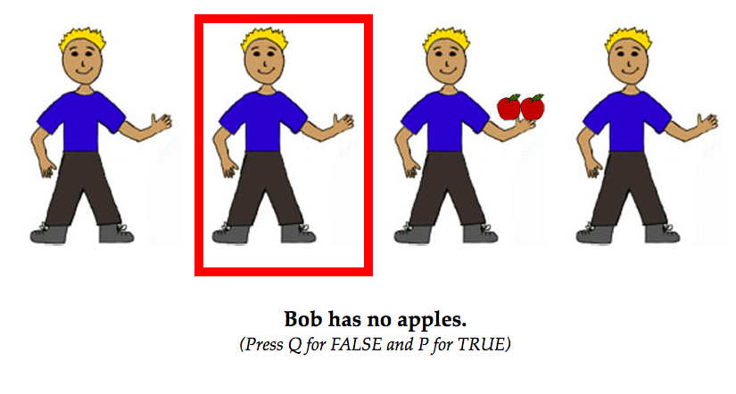

```{r libs}
library(dplyr)
library(ggplot2)
library(lme4)
library(bootstrap)
library(grid)
library(knitr)
```

```{r setup, include=FALSE}
knitr::opts_chunk$set(cache=TRUE, warning=FALSE, message=FALSE)
```

##Quick Summary
Analyses for Nordmeyer & Frank, "Negation is only hard to process when it is not relevant or informative". Details about these experiments can be found at https://github.com/anordmey/negatron. 

This document describes the analyses and findings for Experiment 1. The "speaker" analyses are Experiment 1a and the "listener" analyses are Experiment 1b. 

Participants were randomly assigned to be either speakers or listeners. Context condition indicates the proportion of characters holding items (e.g., how many of the four boys were holding apples). Context varied within subjects. 

This is an example of what a trial looked like:



The experiments can be viewed here: 

Speakers: http://anordmey.github.io/negatron/experiments/experiment1/speakers/negatron.html

Listeners: http://anordmey.github.io/negatron/experiments/experiment1/listeners/negatron.html


## Setting up

Function.

```{r functions}
## number of unique subs
n.unique <- function (x) {
  length(unique(x))
}

#for bootstrapping 95% confidence intervals
theta <- function(x,xdata) {mean(xdata[x])}
ci.low <- function(x) {
  quantile(bootstrap(1:length(x),1000,theta,x)$thetastar,.025)}
ci.high <- function(x) {
  quantile(bootstrap(1:length(x),1000,theta,x)$thetastar,.975)}

```

## Speaker condition

### Prep speaker data

Load in data:

```{r load_speaker_data}
##Load in speaker data
d.speakers <- read.csv("./data/speakers_long.csv")
d.speakers$subid <- as.factor(d.speakers$subid)

genders <- d.speakers %>%
  group_by(gender) %>%
  summarize(n = n.unique(subid))
```
n = `r n.unique(d.speakers$subid)` participants in speaker condition; n = `r filter(genders, gender == "F")$n` female and n = `r filter(genders, gender == "M")$n`
male; `r filter(genders, gender == "Decline")$n` participants declined to state their gender.

Recode context. Context was initially coded as # of context characters with target item. Here we recode as total number of characters (including referent) with target items.

```{r recode_speaker_context}
d.speakers$recode.context <- paste(as.character(d.speakers$context.condition),"/4",sep = "")
d.speakers[d.speakers$trial.type == "item",]$recode.context <- paste(as.character(d.speakers[d.speakers$trial.type == "item",]$context.condition + 1),"/4",sep="")
d.speakers$recode.context <- factor(d.speakers$recode.context)
```

Simplify coding scheme.
In the initial coding scheme, we had multiple codes:   
Several negation codes (empty, no, not, nothing, without, zero).   
Several positive codes ("othernoun" is descriptions of a noun other than the target noun, e.g. "Bob has a table").   
Several other codes ("body" is descriptions of the character's body, "clothing" is descriptions of the character's clothing). 

In the paper, we use a more conservative coding scheme, to strictly parallell the sentences seen in the listener condition.   
Only instances of "no x" are coded as "negation".   
Only descriptions of the target objects are coded as "noun".   
Everything else is coded as "other".

```{r speaker_coding}
#toggling the commented lines will let you see how the data looks if you include other instances of negation. A discussion of how this influences the findings can be found in the speaker results section of the paper.
d.speakers$code.cat <- "Other"
d.speakers[d.speakers$coding == "no",]$code.cat <- "Negation"
#d.speakers[d.speakers$coding == "not",]$code.cat <- "Negation"
#d.speakers[d.speakers$coding == "without",]$code.cat <- "Negation"
#d.speakers[d.speakers$coding == "zero",]$code.cat <- "Negation"
#d.speakers[d.speakers$coding == "nothing",]$code.cat <- "Negation"
d.speakers[d.speakers$coding == "noun",]$code.cat <- "Noun"
d.speakers$code.cat <- factor(d.speakers$code.cat)
```


### Speaker Plots
Table of mean probabilities: 
```{r speaker_means}
##Means by subject
ms.speakers <- bind_rows(
  d.speakers %>% 
    group_by(recode.context, trial.type, subid) %>%
    summarise(count = mean(code.cat == "Negation"), code.cat = "Negative"),
  d.speakers %>% 
    group_by(recode.context, trial.type, subid) %>%
    summarise(count = mean(code.cat == "Noun"), code.cat = "Positive")
) %>%
  group_by(recode.context, trial.type, code.cat) %>%
  summarise(m.cih = ci.high(count),
            m.cil = ci.low(count),
            m = mean(count))

names(ms.speakers) <- c("context","trial.type","sentence.type","m.cih","m.cil","m")
ms.speakers$sentence.type <- factor(ms.speakers$sentence.type, levels=c("Negative","Positive"))

kable(ms.speakers, digits = 2)
```

Probability of producing a negative sentence on nothing trials (e.g., "no apples" when you see a person with nothing) or a positive sentence on item trials (e.g., "apples" when you see a person with apples):

```{r speaker_probs, fig.height = 4, fig.width = 6}
ggplot(data = subset(ms.speakers, 
                     (sentence.type == "Negative" & trial.type == "nothing") |
                       (sentence.type == "Positive" & trial.type == "item")),
       aes(color=sentence.type, y=m, x=context)) +
  geom_line(aes(group = sentence.type), size = 1) +
  geom_linerange(aes(ymin = m.cil, ymax = m.cih), size = 1) +
  ylab("Probability") + 
  xlab("Context Condition") + 
  scale_colour_grey(guide=FALSE) + 
  annotate("text", x=3.5, y=.9, label="True Positive", color="grey", size=5) + 
  annotate("text", x=3, y=.4, label="True Negative", color="black", size=5) + 
  theme_classic(base_size = 18)
```

Surprisal (-log(prob)) of producing a negative sentence on nothing trials (e.g., "no apples" when you see a person with nothing) or a positive sentence on item trials (e.g., "apples" when you see a person with apples). 

```{r speaker_surprisal, fig.height = 4, fig.width = 6}
ggplot(data = subset(ms.speakers, 
                     (sentence.type == "Negative" & trial.type == "nothing") |
                      (sentence.type == "Positive" & trial.type == "item")),
       aes(color = sentence.type, y = -log(m), x = context)) +
  geom_line(aes(group = sentence.type), size = 1) +
  geom_linerange(aes(ymin = -log(m.cil), ymax = -log(m.cih)), size = 1) +
  ylab("Speaker Surprisal") + 
  xlab("Context Condition") + 
  scale_colour_grey(guide=FALSE) + 
  annotate("text", x=2.5, y=.3, label="True Positive", color="grey", size=5) + 
  annotate("text", x=1.75, y=3.75, label="True Negative", color="black", size=5) + 
  theme_classic(base_size = 18)
```

### Speaker Models

First, recode context in two ways. numeric.context is the numeric proportion of characters with target items in the context. dummy.context compares the 0/4 context to all other contexts. 

```{r speaker_recode2}
d.speakers$dummy.context <- 0
d.speakers[d.speakers$recode.context == "0/4",]$dummy.context <- 1

d.speakers$numeric.context <- as.numeric(as.character(factor(d.speakers$recode.context, levels=c("0/4","1/4","2/4","3/4","4/4"), labels=c(0, .25, .5, .75, 1))))
```

Separate analyses of true negs and true pos. Look at effect of context on probability of producing a negative sentence on a nothing trial (e.g. probability of producing true negative sentence):

```{r speaker_truenegs}
d.speakers$negation <- 0
d.speakers[d.speakers$code.cat == "Negation",]$negation <- 1

#Random slopes model does not converge
#model with dummy context
model.neg.nothing <- glmer(negation ~ dummy.context + numeric.context
                + (1 | subid)
                + (1 | item),
                data=filter(d.speakers, trial.type == "nothing"), family = "binomial")
kable(summary(model.neg.nothing)$coefficients, digits = 2)

#model without dummy context
model.neg.nothing_nodummy <- glmer(negation ~ numeric.context
                + (1 | subid)
                + (1 | item),
                data=filter(d.speakers, trial.type == "nothing"), family = "binomial")
kable(summary(model.neg.nothing_nodummy)$coefficients, digits = 2)

anova(model.neg.nothing_nodummy, model.neg.nothing)
```

Look at effect of context on probability of producing a positive sentence about the target item (i.e. "apples") on item trials. 

```{r speaker_truepos}
#Random slopes model does not converge
d.speakers$noun <- 0
d.speakers[d.speakers$code.cat == "Noun",]$noun <- 1

model.pos.item <- glmer(noun ~ numeric.context
                           + (1 | subid)
                           + (1 | item),
                           data=filter(d.speakers, trial.type == "item"), family = "binomial")
kable(summary(model.pos.item)$coefficients, digits = 2)
```

## Listener condition

### Prep listener data

Load in data:

```{r load_listener_data}
##Load in listener data
d.listeners <- read.csv("./data/listeners_long.csv")
d.listeners$subid <- as.factor(d.listeners$subid)

d.listeners$truth.value <- as.numeric(d.listeners$response)
d.listeners[d.listeners$correct == 0,]$truth.value <- 1 - as.numeric(d.listeners[d.listeners$correct == 0,]$response)
d.listeners$truth.value <- as.factor(as.logical(d.listeners$truth.value))

d.listeners$text.condition <- factor(d.listeners$text.condition,levels=c("positive","negative"), labels=c("Positive","Negative"))
d.listeners$response <- factor(d.listeners$response,levels=c("TRUE","FALSE"))

l.genders <- d.listeners %>%
  group_by(gender) %>%
  summarize(n = n.unique(subid))
```
n = `r n.unique(d.listeners$subid)` participants in listener condition; n = `r filter(l.genders, gender == "F")$n` female and n = `r filter(l.genders, gender == "M")$n`male; n = `r filter(l.genders, gender == "Decline")$n` participant declined to state their gender.


Recode context. Context was initially coded as # of context characters with target item. Here we recode as total number of characters (including referent) with target items.

```{r recode_listener_context}
tpresent <- d.listeners %>%
  filter((text.condition == "Positive" & response == TRUE) | 
           (text.condition == "Negative" & response == FALSE)) %>%
  mutate(recode.context = paste(as.character((context.condition + 1)), "/4", sep=""))
  
tabsent <- d.listeners %>%
  filter((text.condition == "Negative" & response == TRUE) | 
           (text.condition == "Positive" & response == FALSE)) %>%
  mutate(recode.context = paste(as.character(context.condition), "/4", sep=""))

d.listeners <- rbind(tpresent, tabsent)
d.listeners$recode.context <- as.factor(d.listeners$recode.context)
```

Look at accuracy across trial types, then remove people with less than 80% accuracy: 

```{r remove_inaccurate_listeners}
#Accuracies across trial types: 
acc <- d.listeners %>%
  group_by(truth.value, text.condition) %>%
  summarize(mean = mean(correct))
kable(acc, digits = 2)

#Now reject anyone with less than 80% correct
propcorrect <- aggregate(correct~subid, data=d.listeners, mean)

reject <- propcorrect[propcorrect$correct < .8,]

for (i in reject$subid) {
	d.listeners<-d.listeners[d.listeners$subid != i,]
}
```
`r nrow(reject)` participants were removed for having less than 80% accuracy on the task, leaving n = `r n.unique(d.listeners$subid)` participants for analysis. 

Remove incorrect trials & trim outliers.

```{r listener_outliers}
#Remove incorrect
d.listeners.c <- d.listeners[d.listeners$correct == 1,]

#LogRT
qplot(data=d.listeners.c, x=rt, geom="histogram")
d.listeners.c$log.rt<-log(d.listeners.c$rt)

#trim outliers outside 3 standard deviations of the log mean
lrt <- d.listeners.c$log.rt
d.listeners.ct <- d.listeners.c[lrt < mean(lrt) + 3*sd(lrt) & lrt > mean(lrt) - 3*sd(lrt),]

qplot(data=d.listeners.ct, x=rt, geom = "histogram")
qplot(data=d.listeners.ct, x=log.rt, geom = "histogram")
```

### Listener Plots
Table of mean RTs: 

```{r listener_means}
ms.listeners <- d.listeners.ct %>%
  group_by(subid, text.condition, recode.context, truth.value) %>%
  summarise(rt = mean(rt)) %>%
  group_by(text.condition, recode.context, truth.value) %>%
  summarise(cih = ci.high(rt),
            cil = ci.low(rt),
            rt = mean(rt))

names(ms.listeners) <- c("sentence.type","context","truth.value","rt.cih","rt.cil","rt")
ms.listeners$sentence.type <- factor(ms.listeners$sentence.type, levels = c("Negative", "Positive"))
ms.listeners$truth.value <- factor(ms.listeners$truth.value, levels = c(TRUE, FALSE), labels = c("True", "False"))

kable(ms.listeners, digits = 2)
```

Plot reaction time: 

```{r listener_rts, fig.height=4, fig.width = 8} 
#quartz()

facet_labels <- c(
  'True' = 'True Sentences', 
  'False' = 'False Sentences'
)

p <- ggplot(data = ms.listeners, aes(colour = sentence.type, y = rt, x = context)) +
  geom_line(aes(group = sentence.type), size = 1) +
  geom_errorbar(aes(ymin = rt.cil, ymax = rt.cih), width = 0, size = 1) +
  facet_wrap(~truth.value, labeller = as_labeller(facet_labels)) +
  scale_y_continuous(name = "RT (ms)", breaks = seq(1000, 2000, 100)) + 
  xlab("Context Condition") + 
  scale_colour_grey(guide= "none") + 
  theme_classic(base_size = 18) + 
  theme(strip.background = element_blank())

text_df <- data.frame(label = c("Negative", "Positive", "", ""),
                      x = c(2, 1.3, "", ""),
                      y = c(1700, 1200, "", ""),
                       truth.value =  c("True", "True", "False", "False"), 
                       sentence.type = c("Negative", "Positive", "Negative", "Positive"))
text_df$sentence.type <- factor(text_df$sentence.type, levels = c("Negative", "Positive"))
text_df$truth.value <- factor(text_df$truth.value, levels = c("True", "False"))
text_df$x <- as.numeric(text_df$x)
text_df$y <- as.numeric(text_df$y)

p + geom_text(
  data = text_df, 
  mapping = aes(x = x, y = y, label = label), 
  size = 5
)
```

### Listener Models 

First, recode context in two ways. numeric.context is the numeric proportion of characters with target items in the context. dummy.context compares the 0/4 context to all other contexts. 

```{r listeners_recode2}
d.listeners.ct$truth.value <- factor(d.listeners.ct$truth.value,levels = c("FALSE","TRUE"))
d.listeners.ct$numeric.context <- as.numeric(as.character(factor(d.listeners.ct$recode.context, levels = c("0/4","1/4","2/4","3/4","4/4"), labels = c("0",".25",".5",".75","1"))))

d.listeners.ct$dummy.context <- 0
d.listeners.ct[d.listeners.ct$recode.context == "0/4",]$dummy.context <- 1
```

Look at interaction between context, sentence type, and truth value.

```{r listener_model1}
model1 <- lmer(rt ~ text.condition*truth.value*numeric.context 
       + (text.condition*truth.value |subid)
       + (text.condition*truth.value |item),
       data = d.listeners.ct)

kable(summary(model1)$coefficients, digits = 2)
```

Effect of context on true negative sentences:

```{r listener_trueneg}
model2 <- lmer(rt ~ dummy.context + numeric.context
               + (dummy.context + numeric.context | subid)
               + (dummy.context + numeric.context  | item),
               data = subset(d.listeners.ct, text.condition == "Negative" & truth.value == TRUE))

kable(summary(model2)$coefficients, digits = 2)
```

```{r listener_truepos}
model3 <- lmer(rt ~ numeric.context
               + (numeric.context | subid)
               + (numeric.context | item),
               data = subset(d.listeners.ct, text.condition == "Positive" & truth.value == TRUE))
kable(summary(model3)$coefficients, digits = 2)
```

## Compare Speakers and Listeners

Only look at true sentences: 

```{r filter_true}
ms.listeners <- ms.listeners[ms.listeners$truth.value == "True",]
ms.listeners <- ms.listeners[,c("context","sentence.type","rt","rt.cih","rt.cil")]

ms.speakers <- subset(ms.speakers, (sentence.type == "Negative" & trial.type == "nothing") | (sentence.type == "Positive" & trial.type == "item"))
```

Calculate surprisal for speakers:

```{r calculate_surprisal}
ms.speakers$surprisal <- -log(ms.speakers$m)
ms.speakers$surprisal.cih <- -log(ms.speakers$m.cih)
ms.speakers$surprisal.cil <- -log(ms.speakers$m.cil)

ms.speakers <- ms.speakers[,c("context","sentence.type","surprisal","surprisal.cih","surprisal.cil")]
```

Merge together: 

```{r merge}
data.ms <- merge(ms.listeners, ms.speakers)
```

Correlation between RT and surprisal, with and without 0/4 context:

```{r correlations}
cor.test(data.ms$rt, data.ms$surprisal)

data.trimmed <- subset(data.ms, context != "0/4")
cor.test(data.trimmed$rt, data.trimmed$surprisal)
```

Plot correlation:

```{r comparison_plot}
mainplot <- ggplot(data.ms, aes(color=sentence.type, y=rt, x=surprisal)) + 
  geom_pointrange(aes(ymin=rt.cil, ymax=rt.cih), size=.1) + 
  geom_errorbarh(aes(xmin=surprisal.cil, xmax=surprisal.cih), size=.1) + 	
  geom_point(aes(color=sentence.type)) + 
  geom_smooth(method="lm", lty="dotted", color="grey60", fill="grey") + 
  #geom_smooth(data=data.trimmed, method="lm", lty="dotted", color="gray10", fill="gray30") + 
  geom_text(aes(label=data.ms$context), hjust=-0.1, vjust=0, size=4.5) +
  #annotate("text", x=.75, y=1525, label="R^2 == .71", parse=TRUE, color="black", size=3.5) + 
  annotate("text", x=2.75, y=1750, label="R^2 == .89", parse=TRUE, color="black", size=5) + 
  annotate("text", x=.85, y=1200, label="True Positive", color="grey50", size=5) + 
  annotate("text", x=1.3, y=1500, label="True Negative", color="black", size=5) +  
  ylab("Listener Reaction Time (ms)") +  xlab("Speaker Surprisal") + 
  scale_colour_manual(values=c("black","grey50"), guide=FALSE) + 
  theme_classic(base_size = 18)

subplot <- ggplot(data.trimmed, aes(color=sentence.type, y=rt, x=surprisal)) +
  geom_pointrange(aes(ymin=rt.cil, ymax=rt.cih), size=.1) + 
  geom_errorbarh(aes(xmin=surprisal.cil, xmax=surprisal.cih), size=.1) + 	
  geom_point(aes(color=sentence.type)) + 
  geom_smooth(method="lm", lty="dotted", color="grey60", fill="grey") + 
  geom_text(aes(label=data.trimmed$context), hjust=-0.1, vjust=0, size=4) +
  annotate("text", x=.5, y=1450, label="R^2 == .89", parse=TRUE, color="black", size=4) + 
  #annotate("text", x=.75, y=1200, label="True Positive", color="grey50", size=3.5) + 
  #annotate("text", x=2, y=1300, label="True Negative", color="black", size=3.5) +  
  ylab("") +  xlab("") + 
  scale_colour_manual(values=c("black","grey50"), guide=FALSE) + 
  theme(panel.border = element_rect(fill = NA),
        panel.background = element_rect(fill = NA), 
        plot.background = element_rect(fill = NA, color = NA), 
        plot.margin = margin(0, 0, 0, 0))

vp <- viewport(width = 0.4, height = 0.4, x = .8, y = .35)

fullplot <- function() {
  print(mainplot)
  print(subplot, vp = vp)
 }

fullplot()
```

