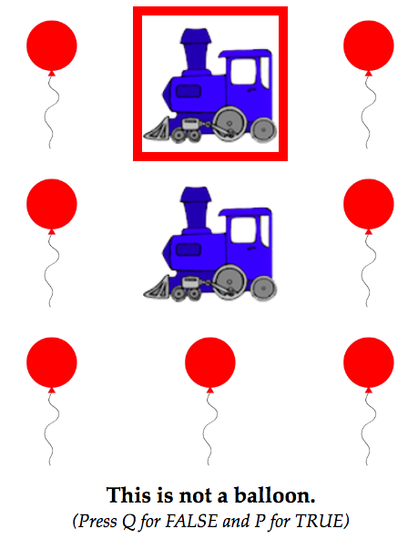
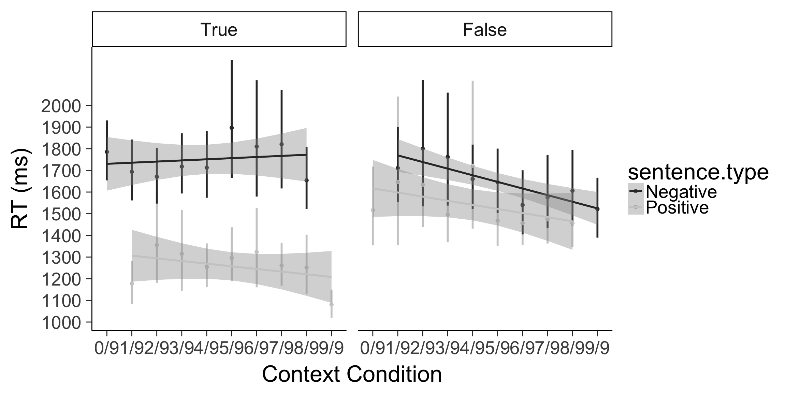

```{r libs}
library(tidyverse)
library(bootstrap)
library(grid)
library(knitr)
```

```{r setup, include=FALSE}
knitr::opts_chunk$set(cache=TRUE, warning=FALSE, message=FALSE)
```

## Quick Summary
Listeners only (sentence verification task), n = 285. There are now 9 characters in a 3x3 grid. Context is within subs. 

This is an example of what a trial looked like:




Here are the listener data: 



## Setting up

Functions and add some style elements for ggplot2.

```{r functions}
## number of unique subs
n.unique <- function (x) {
  length(unique(x))
}

#for bootstrapping 95% confidence intervals
theta <- function(x,xdata) {mean(xdata[x])}
ci.low <- function(x) {
  quantile(bootstrap(1:length(x),1000,theta,x)$thetastar,.025)}
ci.high <- function(x) {
  quantile(bootstrap(1:length(x),1000,theta,x)$thetastar,.975)}

#Plot style
plot.style <- plot.style <- theme_bw() + theme(panel.grid.minor=element_blank(), panel.grid.major=element_blank(), legend.position="right", axis.line = element_line(colour="black",size=.5), axis.ticks = element_line(size=.5), axis.title.x = element_text(vjust=-.5), axis.title.y = element_text(angle=90,vjust=0.25))
```

## Listener condition

### Prep listener data

Load in data:

```{r load_listener_data}
##Load in listener data
d.listeners <- read.csv("data_listeners2.csv")
d.listeners$subid <- as.factor(d.listeners$subid)

d.listeners$truth.value <- as.numeric(d.listeners$response)
d.listeners[d.listeners$correct == 0,]$truth.value <- 1 - as.numeric(d.listeners[d.listeners$correct == 0,]$response)
d.listeners$truth.value <- as.factor(as.logical(d.listeners$truth.value))

d.listeners$text.condition <- factor(d.listeners$text.condition,levels=c("positive","negative"), labels=c("Positive","Negative"))
d.listeners$response <- factor(d.listeners$response,levels=c("TRUE","FALSE"))
```

Recode context. Context was initially coded as # of context characters with target item. Here we recode as total number of characters (including referent) with target items.

```{r recode_listener_context}
tpresent <- d.listeners %>%
  filter((text.condition == "Positive" & truth.value == TRUE) | 
           (text.condition == "Negative" & truth.value == FALSE)) %>%
  mutate(recode.context = paste(as.character((context.condition + 1)), "/9", sep=""))
  
tabsent <- d.listeners %>%
  filter((text.condition == "Negative" & truth.value == TRUE) | 
           (text.condition == "Positive" & truth.value == FALSE)) %>%
  mutate(recode.context = paste(as.character(context.condition), "/9", sep=""))

d.listeners <- rbind(tpresent, tabsent)
d.listeners$recode.context <- as.factor(d.listeners$recode.context)
```

Look at accuracy across trial types, then remove people with less than 80% accuracy: 

```{r remove_inaccurate_listeners}
#Accuracies across trial types: 
acc <- d.listeners %>%
  group_by(truth.value, text.condition) %>%
  summarize(mean = mean(correct))
kable(acc, digits = 2)

#Now reject anyone with less than 80% correct
propcorrect <- aggregate(correct~subid, data=d.listeners, mean)

reject <- propcorrect[propcorrect$correct < .8,]

for (i in reject$subid) {
	d.listeners<-d.listeners[d.listeners$subid != i,]
}
```

Remove incorrect trials & trim outliers.

```{r listener_outliers}
#Remove incorrect
d.listeners.c <- d.listeners[d.listeners$correct == 1,]

#there are a few absurdly long RTs. Filter them; discuss best options to deal with this.
d.listeners.c <- d.listeners.c %>%
  filter(rt < 50000)

#LogRT
qplot(data=d.listeners.c, x=rt, geom="histogram")
d.listeners.c$log.rt<-log(d.listeners.c$rt)

#trim outliers outside 3 standard deviations of the log mean
lrt <- d.listeners.c$log.rt
lrt <- !is.na(lrt)
d.listeners.ct <- d.listeners.c[lrt < mean(lrt) + 3*sd(lrt) & lrt > mean(lrt) - 3*sd(lrt),]

qplot(data=d.listeners.ct, x=rt, geom = "histogram")
qplot(data=d.listeners.ct, x=log.rt, geom = "histogram")
```

n = `r n.unique(d.listeners$subid)` participants in listener condition.

### Listener Plots
Table of mean probabilities: 

```{r listener_means}
ms.listeners <- d.listeners.ct %>%
  group_by(subid, text.condition, recode.context, truth.value) %>%
  summarise(rt = mean(rt)) %>%
  group_by(text.condition, recode.context, truth.value) %>%
  summarise(cih = ci.high(rt),
            cil = ci.low(rt),
            rt = mean(rt))

names(ms.listeners) <- c("sentence.type","context","truth.value","rt.cih","rt.cil","rt")
ms.listeners$sentence.type <- factor(ms.listeners$sentence.type, levels = c("Negative", "Positive"))
ms.listeners$truth.value <- factor(ms.listeners$truth.value, levels = c(TRUE, FALSE), labels = c("True", "False"))

kable(ms.listeners, digits = 2)
```

Plot reaction time; Figure 4 in paper: 

```{r listener_rts, fig.width=12, fig.height=6} 


#quartz()
ggplot(data = ms.listeners, aes(color = sentence.type, y = rt, x = context)) +
  #geom_line(aes(group = sentence.type), size = 1) +
  geom_errorbar(aes(ymin = rt.cil, ymax = rt.cih), width = 0, size = 1) +
  geom_point(aes(color = sentence.type)) +
  geom_smooth(aes(group = sentence.type), method = "lm") +
  facet_wrap(~truth.value) +
  scale_y_continuous(name = "RT (ms)", breaks = seq(1000, 2000, 100)) + 
  xlab("Context Condition") + 
  #scale_colour_grey(guide=FALSE) + 
  scale_colour_grey() +
  theme_classic(base_size = 25)
```

